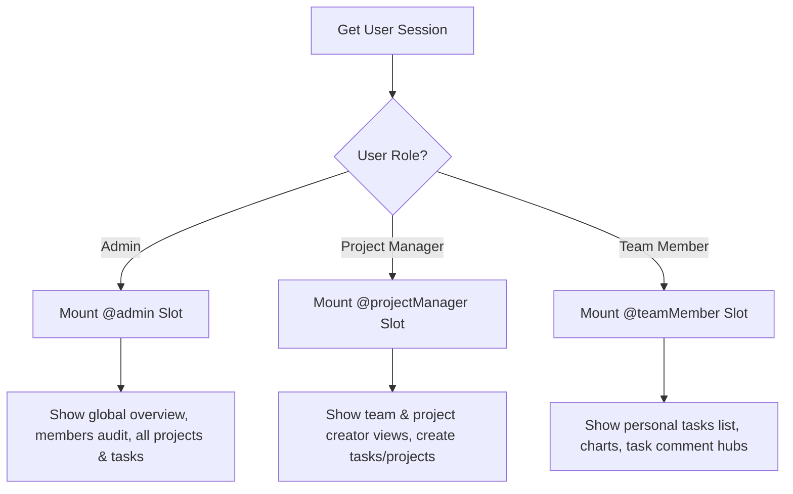

# ⚡ TaskFlow Frontend - Next.js 16 Dashboard Interface

TaskFlow Frontend is a high-performance, role-based project management and task collaboration user interface. Built with **Next.js 16 (App Router)**, **React 19**, **TypeScript**, and **Tailwind CSS v4**, the application implements Next.js Parallel Routing to present personalized workspaces dynamically adjusted to a user's role: **Admin**, **Project Manager**, or **Team Member**.

---

## 🛠️ Technology Stack & Badges

| Category | Technology | Description |
| :--- | :--- | :--- |
| **Framework & Engine** |   | React Server Components & server-side rendering support. |
| **Styling & Theme** |   | Tailwind v4 compilation with dark/light mode toggle. |
| **Components & Icons** |   | Beautiful accessible component primitives (Radix UI) and icons. |
| **Animations & Graphs** |   | Rich dashboard graphs and micro-animations for fluid UX. |
| **Data Fetching** |   | Strict payload validation schema and server action queries. |

---

## 🏛️ Routing Slots & Dashboard Mounting

To achieve isolated dashboard scopes, this project leverages **Next.js Parallel Routes** inside the [dashboard layout](file:///l:/Project-6/Task%20Collaboration%20System/fontend/src/app/(dashboardLayout)/dashboard/layout.tsx). The router validates session cookies and routes users to specific slot views matching their role:



### Slot Configurations

*   **`@admin`**: Accessible strictly by users with the `Admin` role. Handles directory management, member promotion/suspension/deletion, global project/task tracking, and systemic audit logs.
*   **`@projectManager`**: Dedicated to `ProjectManager` role. Handles project drafting, teammate assignments, task planning, and status updates.
*   **`@teamMember`**: Dedicated to `TeamMember` role. Focuses on personal task board Kanban boards, progress reporting, and task discussions.

---

## 📂 Repository Layout

```filepath
fontend/
├── public/                 # Static assets (images, icons, etc.)
├── src/
│   ├── app/                # App Router Layouts and Routing Groups
│   │   ├── (commonLayout)/ # Landing pages, static blocks, and auth entryways
│   │   │   ├── (auth)/     # Login, signup, and registration pages
│   │   │   ├── about/      # Static platform information
│   │   │   ├── activities/ # Activity showcase views
│   │   │   └── analytics/  # Analytics dashboard views
│   │   ├── (dashboardLayout)/
│   │   │   └── dashboard/  # Dashboard views separated by parallel slots
│   │   │       ├── @admin/         # Admin slot views
│   │   │       ├── @projectManager/# PM slot views
│   │   │       ├── @teamMember/    # Team member slot views
│   │   │       ├── notifications/  # Dashboard notification center
│   │   │       ├── projects/       # Shared project views
│   │   │       └── tasks/          # Shared task detailed boards
│   │   ├── api/            # Local server routes & proxies
│   │   ├── globals.css     # Tailwind CSS import declarations
│   │   └── layout.tsx      # Core application wrapper
│   ├── components/         # Shared and modular UI components
│   │   ├── Admin/          # Member rows and admin control blocks
│   │   ├── Dashboard/      # Task boards, charts, timelines, comment sections
│   │   ├── ui/             # shadcn/ui custom components (buttons, sidebar, dropdowns)
│   │   └── shared/         # Navbar, theme toggler, and footer modules
│   ├── hooks/              # Custom React hooks
│   ├── lib/                # Config files, env variables validator, cookie utils
│   ├── router/             # Static navigation menus for user roles
│   ├── services/           # Server actions & data controllers
│   ├── types/              # Universal TypeScript models
│   ├── zod/                # Auth schemas and client validations
│   └── proxy.ts            # Proxy middleware router core logic
├── package.json            # Scripts & project configurations
├── next.config.ts          # Next.js bundler settings
├── tailwind.config.js      # CSS styling extensions
└── tsconfig.json           # TypeScript configuration
```

---

## 🔑 Environment Variables Setup

Create a `.env.local` file in the root of the `fontend` folder and configure the matching variables:

```env
# Public Configs (Accessible on Client & Server)
NEXT_PUBLIC_API_BASE_URL="http://localhost:3000"
NEXT_PUBLIC_APP_NAME="TaskFlow"
NEXT_PUBLIC_APP_ORIGIN="http://localhost:3001"

# Imgbb token for task attachment and profile picture uploads
NEXT_PUBLIC_IIMGBB_KEY="your-imgbb-public-key"

# Private Configs (Accessible only on Server Actions)
BASE_API_URL="http://localhost:3000"
JWT_ACCESS_SECRET="your-jwt-access-secret-matching-backend"
JWT_REFRESH_SECRET="your-jwt-refresh-secret-matching-backend"
IIMGBB_KEY="your-imgbb-server-key"
```

---

## ⚡ Setup & Installation

1.  **Clone the workspace** and navigate to the `fontend` directory:
    ```bash
    cd fontend
    ```

2.  **Install dependencies** using `pnpm` (which handles version locking):
    ```bash
    pnpm install
    ```

3.  **Run Development Server**:
    Launch the Next.js development server:
    ```bash
    pnpm dev
    ```
    Open `http://localhost:3001` (or the port defined by your dev environment) to view the app.

---

## 📘 Available Scripts

*   `pnpm dev`: Runs Next.js dev server on watch mode.
*   `pnpm build`: Performs TypeScript type compilation and bundles production-ready files.
*   `pnpm start`: Runs the built Next.js server locally in production mode.
*   `pnpm lint`: Examines TS/JS files for syntax errors and warnings using ESLint.

---

## 🔄 Proxy Layer & Authentication Hooks

The system uses [src/proxy.ts](file:///l:/Project-6/Task%20Collaboration%20System/fontend/src/proxy.ts) to manage proxy requests and cookie lifecycles:

*   **Token Refresh Syncing**: If the `accessToken` cookie expires, the proxy automatically attempts to make a server-side request to `/auth/refresh-token` with the `refreshToken` and transparently updates cookies.
*   **Redirect Guards**: Protects `/dashboard` routes from anonymous traffic, redirection to `/login` if authentication is invalid.

> [!TIP]
> To apply the route protection proxy logic globally, create a standard Next.js `middleware.ts` in the `src/` folder that exports the `proxy` controller:
> ```typescript
> // src/middleware.ts
> import { proxy } from "./proxy";
> export default proxy;
> export { config } from "./proxy";
> ```

---

## 📊 Dashboard Visualizations

Through **Recharts**, the dashboard provides instant analytics:
*   **Task Distribution**: Visual breakdown of task statuses (`Todo`, `InProgress`, `Completed`).
*   **Project Allocations**: Status split metrics showing active vs on-hold vs completed projects.
*   **Productivity Charts**: Progress markers tracking user assignments and completed checklists.
